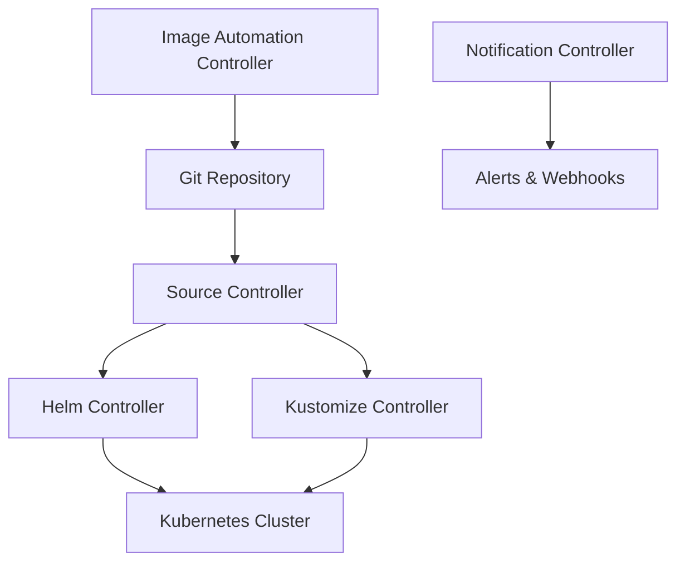

# Flux CD - Complete Guide for GitOps

A comprehensive guide to understanding Flux CD, its architecture, benefits, and essential commands for managing GitOps deployments.

## 📋 Table of Contents

- [What is Flux CD?](#what-is-flux-cd)
- [Flux Architecture](#flux-architecture)
- [Core Concepts](#core-concepts)
- [Benefits of Using Flux](#benefits-of-using-flux)
- [Flux vs Traditional Deployment](#flux-vs-traditional-deployment)
- [Installation and Setup](#installation-and-setup)
- [Essential Flux Commands](#essential-flux-commands)
- [Debugging and Troubleshooting](#debugging-and-troubleshooting)
- [Best Practices](#best-practices)
- [Redis Sentinel Use Case](#redis-sentinel-use-case)

## 🎯 What is Flux CD?

**Flux CD** is a **Continuous Deployment** tool that implements **GitOps** principles for Kubernetes. It's a Cloud Native Computing Foundation (CNCF) graduated project that automates the deployment and management of applications in Kubernetes clusters.

### GitOps Principles

Flux implements the four core GitOps principles:

1. **📝 Declarative**: Infrastructure and applications are described declaratively
2. **🔄 Versioned and Immutable**: Everything is stored in Git with full version history
3. **👁️ Pulled Automatically**: Changes are automatically pulled from Git to the cluster
4. **🔁 Continuously Reconciled**: The actual state is continuously reconciled with the desired state

### Key Philosophy

```
Git Repository (Source of Truth) → Flux Controller → Kubernetes Cluster (Target State)
```

**"Git is the single source of truth, and the cluster state should match what's in Git"**

## 🏗️ Flux Architecture

Flux CD v2 consists of multiple specialized controllers working together:

### Core Controllers



#### 1. **Source Controller** 
- **Purpose**: Manages Git repositories, Helm repositories, and OCI artifacts
- **Resources**: `GitRepository`, `HelmRepository`, `Bucket`, `OCIRepository`
- **Function**: Downloads and caches source artifacts

#### 2. **Helm Controller**
- **Purpose**: Manages Helm releases from HelmRepository sources
- **Resources**: `HelmRelease`
- **Function**: Installs, upgrades, and manages Helm charts

#### 3. **Kustomize Controller** 
- **Purpose**: Manages Kustomize deployments from Git sources
- **Resources**: `Kustomization`
- **Function**: Applies Kustomize manifests to the cluster

#### 4. **Notification Controller**
- **Purpose**: Handles alerts and notifications
- **Resources**: `Alert`, `Provider`, `Receiver`
- **Function**: Sends notifications to Slack, Discord, email, etc.

#### 5. **Image Automation Controller**
- **Purpose**: Automates image updates in Git repositories
- **Resources**: `ImageRepository`, `ImagePolicy`, `ImageUpdateAutomation`
- **Function**: Updates container image tags automatically

## 🧩 Core Concepts

### 1. **Source** (What to Deploy)
Defines where your application configuration comes from:

```yaml
# GitRepository Example
apiVersion: source.toolkit.fluxcd.io/v1
kind: GitRepository
metadata:
  name: my-app
spec:
  interval: 1m
  url: https://github.com/example/my-app
  ref:
    branch: main

# HelmRepository Example
apiVersion: source.toolkit.fluxcd.io/v1
kind: HelmRepository
metadata:
  name: bitnami
spec:
  interval: 5m
  url: oci://registry-1.docker.io/bitnamicharts
  type: oci
```

### 2. **Workload** (How to Deploy)
Defines how your application should be deployed:

```yaml
# HelmRelease Example
apiVersion: helm.toolkit.fluxcd.io/v2
kind: HelmRelease
metadata:
  name: redis-sentinel
spec:
  interval: 5m
  chart:
    spec:
      chart: redis
      sourceRef:
        kind: HelmRepository
        name: bitnami
  values:
    architecture: replication
    auth:
      enabled: true
```

### 3. **Reconciliation Loop**
Flux continuously compares the **desired state** (Git) with the **actual state** (cluster):

```
1. Fetch latest changes from Git
2. Compare with current cluster state  
3. Apply differences to reach desired state
4. Wait for reconciliation interval
5. Repeat
```

## 🚀 Benefits of Using Flux

### 1. **GitOps Automation**
- **✅ Automated Deployments**: Changes in Git automatically trigger deployments
- **✅ Rollback Capability**: Git history provides instant rollback to any previous state
- **✅ Audit Trail**: Complete deployment history tracked in Git commits

### 2. **Security & Compliance**
- **🔒 Pull-based Model**: Cluster pulls changes instead of external push access
- **🔒 No Cluster Credentials in CI/CD**: No need to store kubectl credentials externally
- **🔒 RBAC Integration**: Flux respects Kubernetes RBAC policies
- **🔒 Git Security**: Leverage Git's security model (SSH keys, GPG signing)

### 3. **Developer Experience**
- **👥 Git-native Workflow**: Developers use familiar Git workflows
- **👥 Pull Request Reviews**: Infrastructure changes go through code review
- **👥 Self-service Deployments**: Developers can deploy by merging PRs
- **👥 Environment Parity**: Same process for dev, staging, and production

### 4. **Operational Excellence**
- **📊 Drift Detection**: Automatically detects and corrects configuration drift
- **📊 Multi-tenancy**: Supports multiple teams and applications in one cluster
- **📊 Disaster Recovery**: Entire cluster state can be restored from Git
- **📊 Progressive Delivery**: Supports canary deployments and feature flags

### 5. **Kubernetes Native**
- **⚙️ CRD-based**: Uses Kubernetes Custom Resources for configuration
- **⚙️ Controller Pattern**: Follows Kubernetes controller architecture
- **⚙️ Event-driven**: Reacts to Kubernetes events and resource changes
- **⚙️ Namespace Isolation**: Supports multi-tenant deployments

## ⚖️ Flux vs Traditional Deployment

| Aspect | Traditional CI/CD | Flux GitOps |
|--------|------------------|-------------|
| **Deployment Model** | Push (CI/CD pushes to cluster) | Pull (Cluster pulls from Git) |
| **Access Control** | CI/CD needs cluster credentials | No external cluster access needed |
| **State Management** | Imperative (kubectl apply) | Declarative (desired state in Git) |
| **Rollback** | Manual process | Git revert + automatic sync |
| **Drift Detection** | None | Automatic detection and correction |
| **Audit Trail** | CI/CD logs | Git commit history |
| **Security** | Credentials in CI/CD | Cluster-internal operations only |
| **Multi-environment** | Multiple CI/CD pipelines | Branch-based or repo-based |

### Traditional Workflow
```
Developer → Git Push → CI/CD Pipeline → kubectl apply → Kubernetes Cluster
```

### Flux GitOps Workflow
```
Developer → Git Push → Git Repository ← Flux Controller ← Kubernetes Cluster
                                      ↓
                               Automatic Sync
```

## 🔧 Installation and Setup

### 1. Install Flux CLI

```bash
# macOS
brew install fluxcd/tap/flux

# Linux
curl -s https://fluxcd.io/install.sh | sudo bash

# Windows (Chocolatey)
choco install flux

# Verify installation
flux version
```

### 2. Pre-flight Check

```bash
# Check if cluster is compatible
flux check --pre

# Expected output:
# ✓ Kubernetes 1.28.0 >=1.26.0-0
# ✓ prerequisites checks passed
```

### 3. Bootstrap Flux (Full Installation)

```bash
# Bootstrap with GitHub (creates repository if needed)
flux bootstrap github \
  --owner=your-username \
  --repository=fleet-infra \
  --branch=main \
  --path=./clusters/my-cluster \
  --personal

# Bootstrap with existing Git repository
flux bootstrap git \
  --url=ssh://git@github.com/your-username/fleet-infra \
  --branch=main \
  --path=./clusters/my-cluster
```

### 4. Install Only Controllers (Our Approach)

```bash
# Install just the controllers (without Git integration)
flux install --components=source-controller,helm-controller

# Verify installation
kubectl get pods -n flux-system
```

## 🛠️ Essential Flux Commands

### Installation & Management

```bash
# Install Flux controllers
flux install

# Install specific components only
flux install --components=source-controller,helm-controller,kustomize-controller

# Upgrade Flux installation
flux install --upgrade

# Uninstall Flux
flux uninstall

# Check Flux status
flux check

# Get Flux version
flux version
```

### Source Management

```bash
# Create a Git source
flux create source git my-app \
  --url=https://github.com/example/my-app \
  --branch=main \
  --interval=1m

# Create a Helm repository source
flux create source helm bitnami \
  --url=https://charts.bitnami.com/bitnami \
  --interval=10m

# Create an OCI Helm repository
flux create source helm bitnami-oci \
  --url=oci://registry-1.docker.io/bitnamicharts \
  --interval=5m

# List sources
flux get sources all

# Get source details
flux get source git my-app
flux get source helm bitnami

# Delete a source
flux delete source git my-app
```

### HelmRelease Management

```bash
# Create a HelmRelease
flux create helmrelease redis \
  --source=HelmRepository/bitnami \
  --chart=redis \
  --target-namespace=redis-system \
  --create-target-namespace \
  --interval=5m

# List HelmReleases
flux get helmreleases
flux get hr  # shorthand

# Get specific HelmRelease details
flux get helmrelease redis

# Suspend a HelmRelease (stop reconciliation)
flux suspend helmrelease redis

# Resume a HelmRelease
flux resume helmrelease redis

# Delete a HelmRelease
flux delete helmrelease redis
```

### Kustomization Management

```bash
# Create a Kustomization
flux create kustomization my-app \
  --source=GitRepository/my-app \
  --path="./manifests" \
  --prune=true \
  --interval=1m

# List Kustomizations
flux get kustomizations
flux get ks  # shorthand

# Suspend/Resume Kustomizations
flux suspend kustomization my-app
flux resume kustomization my-app
```

### Reconciliation Control

```bash
# Force immediate reconciliation of a source
flux reconcile source git my-app
flux reconcile source helm bitnami

# Force immediate reconciliation of a HelmRelease
flux reconcile helmrelease redis

# Force immediate reconciliation of a Kustomization
flux reconcile kustomization my-app

# Reconcile with source update
flux reconcile helmrelease redis --with-source
```

### Resource Monitoring

```bash
# Get all Flux resources
flux get all

# Watch resources in real-time
flux get all --watch

# Get resources from all namespaces
flux get all --all-namespaces

# Get specific resource types
flux get sources all
flux get helmreleases --all-namespaces
flux get kustomizations
```

### Export & Backup

```bash
# Export a HelmRelease configuration
flux export helmrelease redis > redis-helmrelease.yaml

# Export a source configuration  
flux export source helm bitnami > bitnami-source.yaml

# Export all resources
flux export --all > flux-backup.yaml
```

## 🔍 Debugging and Troubleshooting

### 1. General Health Check

```bash
# Check overall Flux health
flux check

# Check specific controllers
kubectl get pods -n flux-system

# Check controller logs
kubectl logs -n flux-system deployment/source-controller
kubectl logs -n flux-system deployment/helm-controller
```

### 2. Source Debugging

```bash
# Check source status
flux get sources all

# Describe source for detailed events
kubectl describe gitrepository my-app
kubectl describe helmrepository bitnami

# Check source controller logs
kubectl logs -n flux-system deployment/source-controller -f
```

**Common Source Issues:**
- **Authentication failures**: Check Git credentials or Helm repository access
- **Network issues**: Verify connectivity to Git/Helm repositories
- **Invalid URLs**: Ensure repository URLs are correct

### 3. HelmRelease Debugging

```bash
# Check HelmRelease status
flux get helmreleases

# Describe HelmRelease for events
kubectl describe helmrelease redis

# Check Helm releases directly
helm list -A

# Check Helm release history
helm history redis-dev-redis-sentinel -n redis-sentinel-dev

# Get Helm release values
helm get values redis-dev-redis-sentinel -n redis-sentinel-dev
```

**Common HelmRelease Issues:**
- **Chart not found**: Verify chart name and version in HelmRepository
- **Values validation errors**: Check Helm values syntax
- **Resource conflicts**: Check for existing resources with same names
- **RBAC issues**: Verify service account permissions

### 4. Application Debugging

```bash
# Check deployed resources
kubectl get all -n your-namespace

# Check pod status and logs
kubectl describe pod your-pod -n your-namespace
kubectl logs your-pod -n your-namespace

# Check events in namespace
kubectl get events -n your-namespace --sort-by='.lastTimestamp'
```

### 5. Force Reconciliation for Debugging

```bash
# Force source update
flux reconcile source git my-app

# Force HelmRelease update
flux reconcile helmrelease redis --with-source

# Watch reconciliation in real-time
flux get helmrelease redis --watch
```

### 6. Troubleshooting Commands by Error Type

#### "HelmRelease not ready"
```bash
kubectl describe helmrelease redis
kubectl logs -n flux-system deployment/helm-controller
helm history redis-dev-redis-sentinel -n redis-sentinel-dev
```

#### "Source not ready"
```bash
kubectl describe gitrepository my-app
kubectl logs -n flux-system deployment/source-controller
flux reconcile source git my-app
```

#### "Resource stuck in pending"
```bash
kubectl get events -n your-namespace
kubectl describe pod your-pod -n your-namespace
kubectl top nodes
kubectl get pv,pvc
```

## 🎯 Best Practices

### 1. Repository Structure
```
GitOps Repository/
├── clusters/
│   ├── staging/
│   └── production/
├── infrastructure/
│   ├── kustomization.yaml
│   └── sources/
└── apps/
    ├── base/
    └── overlays/
```

### 2. Reconciliation Intervals
- **Sources**: 5-10 minutes for production, 1-2 minutes for development
- **HelmReleases**: 5-15 minutes depending on change frequency
- **Use shorter intervals for critical applications**

### 3. Security
```bash
# Use SSH keys for private repositories
flux create source git private-repo \
  --url=ssh://git@github.com/private/repo \
  --ssh-key-algorithm=rsa \
  --ssh-rsa-bits=4096

# Use Git over HTTPS with tokens
flux create source git my-app \
  --url=https://github.com/example/my-app \
  --username=flux \
  --password=$GITHUB_TOKEN
```

### 4. Resource Organization
- **Use namespaces** to isolate different applications
- **Label resources** consistently for easier management
- **Use Kustomize** for environment-specific configurations

### 5. Monitoring and Alerting
```bash
# Create notification provider
flux create alert-provider slack \
  --type=slack \
  --webhook-url=$SLACK_WEBHOOK

# Create alert for failures
flux create alert my-app-alert \
  --provider-ref=slack \
  --event-severity=error \
  --event-source=GitRepository/my-app
```

## 🔧 Redis Sentinel Use Case

In our Redis Sentinel deployment, Flux provides:

### 1. **GitOps Workflow**
```
Developer changes → Git commit → Flux detects → HelmRelease updated → Redis deployed
```

### 2. **Key Components**
- **HelmRepository**: Manages Bitnami chart repository
- **HelmRelease**: Deploys Redis Sentinel with specific values
- **Kustomize**: Handles environment-specific configurations and secrets

### 3. **Flux Resources in Our Setup**
```bash
# Source management
kubectl get helmrepository redis-sentinel -n redis-sentinel-dev

# Workload management  
kubectl get helmrelease redis-sentinel -n redis-sentinel-dev

# Check status
flux get helmreleases -n redis-sentinel-dev
```

### 4. **Debugging Our Redis Deployment**
```bash
# Check HelmRelease status
flux describe helmrelease redis-sentinel -n redis-sentinel-dev

# Force reconciliation
flux reconcile helmrelease redis-sentinel -n redis-sentinel-dev --with-source

# Check Helm release directly
helm status redis-sentinel-dev-redis-sentinel -n redis-sentinel-dev
```

### 5. **Benefits for Redis Sentinel**
- **🔄 Automated Updates**: Chart updates deployed automatically
- **🔒 Secure Secret Management**: Kustomize handles Redis passwords
- **🌍 Multi-Environment**: Same process for dev/staging/production
- **📊 Drift Detection**: Ensures Redis configuration stays consistent
- **🔙 Easy Rollbacks**: Git-based rollback for any Redis configuration

## 📚 Additional Resources

- **Official Documentation**: https://fluxcd.io/docs/
- **GitHub Repository**: https://github.com/fluxcd/flux2
- **Slack Community**: https://cloud-native.slack.com/ (#flux)
- **Best Practices Guide**: https://fluxcd.io/docs/guides/
- **Security Guide**: https://fluxcd.io/docs/security/

---

**Last Updated**: $(date +"%Y-%m-%d")  
**Flux Version**: v2.5.1  
**Documentation Version**: 1.0 